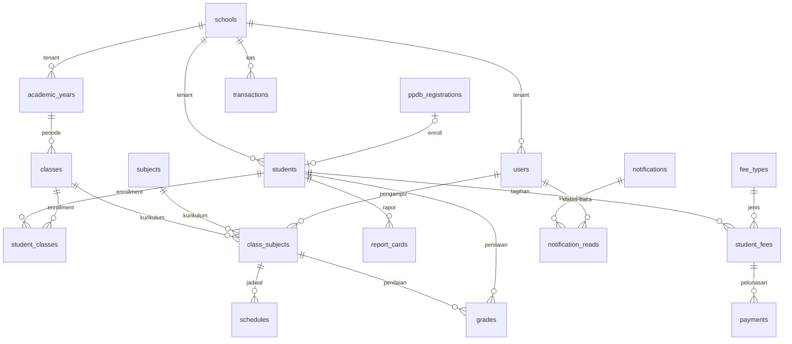

# Smart Sukses School — Entity Relationship Diagram

---

| Parameter | Detail |
|---|---|
| **Nama Produk** | Smart Sukses School |
| **Platform** | `apps.smartsukses.sch.id` |
| **Versi Dokumen** | v1.0 |
| **Sumber Utama** | `blueprint/SmartSukses_FullBlueprint_v1.0.0.docx` Bagian 2 (ERD) · `docs/01-PRD.md` v1.1 · `docs/02-ROADMAP.md` v1.1 · `docs/03-USER_FLOW.md` v1.0 |
| **Jumlah Entitas** | **21 tabel utama** (Blueprint §2.1) |
| **Pola Database** | Shared Database, Shared Schema — isolasi via kolom `school_id` |
| **DBMS** | MySQL 8.0+ |
| **Sifat Dokumen** | Turunan blueprint. Tidak menambah, mengurangi, atau mengubah requirement. |
| **Kerahasiaan** | KONFIDENSIAL — hanya untuk penggunaan internal |

> **Konvensi dokumen:** Setiap informasi yang tidak tercantum dalam blueprint ditulis sebagai **"Belum dijelaskan dalam blueprint."**

> **Batasan dokumen:** Dokumen ini **tidak memuat SQL, migration, maupun model Laravel** — hanya rancangan konseptual dan logis.

---

## Daftar Isi

| No | Section |
|---|---|
| 1 | [Overview](#1-overview) |
| 2 | [Database Design Principles](#2-database-design-principles) |
| 3 | [Entity List](#3-entity-list) |
| 4 | [Relationship Matrix](#4-relationship-matrix) |
| 5 | [Relationship Description](#5-relationship-description) |
| 6 | [Mermaid ER Diagram](#6-mermaid-er-diagram) |
| 7 | [Normalization Notes](#7-normalization-notes) |
| 8 | [Multi Tenant Strategy](#8-multi-tenant-strategy) |
| 9 | [Audit Strategy](#9-audit-strategy) |
| 10 | [Future Expansion](#10-future-expansion) |
| 11 | [Lampiran](#11-lampiran) |

---

## 1. Overview

### 1.1 Tujuan Dokumen

Dokumen ini menyusun **Entity Relationship Diagram (ERD) konseptual dan logis** sebagai dasar implementasi database Smart Sukses School.

| ID | Tujuan | Penjelasan |
|---|---|---|
| **TE-01** | Memetakan **21 entitas** beserta relasinya secara utuh | Blueprint §2.1 dan §2.2 |
| **TE-02** | Menjadi acuan tunggal struktur data sebelum migration ditulis | Roadmap §2.2 (tahap Design) |
| **TE-03** | Memastikan **kunci isolasi tenant** (`school_id`) terpasang pada seluruh tabel bisnis | CON-14; CON-15 |
| **TE-04** | Mendokumentasikan **integritas referensial** antar entitas | Blueprint §2.2 kolom Key |
| **TE-05** | Menandai secara eksplisit bagian struktur data yang **belum dijelaskan blueprint** | Konvensi dokumen |
| **TE-06** | Menjadi dasar penyusunan skenario pengujian isolasi data | Roadmap §2.4; Lampiran A.3 #1 |

### 1.2 ERD Ini Dibuat Berdasarkan Blueprint

Seluruh entitas, kolom, tipe data, dan relasi dalam dokumen ini **bersumber langsung dari Bagian 2 blueprint** (Entity Relationship Diagram — Skema Database: Definisi Tabel & Relasi). Ketentuan yang berlaku:

| Ketentuan | Keterangan |
|---|---|
| **Tidak ada entitas baru** | Hanya 21 tabel yang didaftarkan blueprint §2.1 |
| **Tidak ada kolom baru** | Definisi kolom mengikuti blueprint §2.2 apa adanya |
| **Tidak ada perubahan tipe data** | Tipe, nullability, dan key mengikuti blueprint |
| **Kekosongan ditandai eksplisit** | Struktur yang tidak didefinisikan blueprint ditulis "Belum dijelaskan dalam blueprint." |
| **Catatan analisis dipisahkan** | Bila dokumen ini mengamati sesuatu (mis. denormalisasi), catatan tersebut **bersifat observasi, bukan usulan perubahan** |

### 1.3 Pernyataan Kunci dari Blueprint

> *"Platform menggunakan **21 tabel utama** dalam satu database MySQL yang di-share antar tenant, dengan isolasi data melalui kolom `school_id` (Shared Database, Shared Schema pattern)."* — Blueprint §2.1

> *"Setiap tabel yang memiliki kolom `school_id` otomatis terisolasi per tenant. Semua query pada aplikasi **WAJIB** menggunakan global scope Laravel yang menambahkan `WHERE school_id = auth()->user()->school_id` secara otomatis."* — Blueprint §2.1 Catatan

### 1.4 Ringkasan Entitas per Kelompok

| Kelompok | Jumlah | Entitas |
|---|:---:|---|
| **Core** | 4 | `schools` · `users` · `roles` · `model_has_roles` |
| **Akademik** | 7 | `students` · `academic_years` · `classes` · `student_classes` · `subjects` · `class_subjects` · `schedules` |
| **PPDB** | 1 | `ppdb_registrations` |
| **Penilaian** | 3 | `grades` · `report_cards` · `grade_configs` |
| **Keuangan** | 4 | `fee_types` · `student_fees` · `payments` · `transactions` |
| **Komunikasi** | 2 | `notifications` · `notification_reads` |
| **TOTAL** | **21** | |

---

## 2. Database Design Principles

### 2.1 Normalisasi

| Aspek | Ketentuan | Dasar |
|---|---|---|
| Target normalisasi | Struktur blueprint umumnya memenuhi **3NF**, dengan beberapa pengecualian yang dinyatakan disengaja | Analisis §7 |
| Pemisahan entitas | Data induk dipisahkan dari data transaksional (mis. `fee_types` vs `student_fees`) | Blueprint §2.2 |
| Tabel pivot | Relasi many-to-many diwujudkan melalui tabel pivot: `student_classes`, `class_subjects`, `model_has_roles`, `notification_reads` | Blueprint §2.1 |
| Denormalisasi terkendali | `payments.student_id` sengaja diduplikasi — blueprint menyebutnya *"denormalized untuk query cepat"* | Blueprint §2.2 tabel `payments` |
| Penyimpanan JSON | `report_cards.final_scores`, `grade_configs.components`, `ppdb_registrations.documents` | Blueprint §2.2 |

Rincian analisis 1NF/2NF/3NF terdapat pada [§7 Normalization Notes](#7-normalization-notes).

### 2.2 Referential Integrity

| Aspek | Ketentuan | Dasar |
|---|---|---|
| Kunci utama | Seluruh tabel memakai `id` bertipe `BIGINT UNSIGNED`, auto-increment | Blueprint §2.2 |
| Kunci asing | Ditandai `FK` pada kolom Key di setiap definisi tabel | Blueprint §2.2 |
| Kunci unik | `schools.code`, `schools.slug`, `users.email`, `ppdb_registrations.reg_number` | Blueprint §2.2 |
| Integritas dijaga ORM | Query melalui Eloquent (parameterized); raw SQL dilarang kecuali `DB::select()` dengan binding | Blueprint §3.4; CON-10 |
| **⚠ Belum dijelaskan** | Aturan `ON DELETE` / `ON UPDATE` untuk setiap foreign key (CASCADE, RESTRICT, SET NULL) | **Belum dijelaskan dalam blueprint.** |

### 2.3 Foreign Key

| Aspek | Keterangan |
|---|---|
| Jumlah relasi FK | **43 relasi** — lihat [§4 Relationship Matrix](#4-relationship-matrix) |
| FK ke `schools.id` | 17 tabel (seluruh tabel bisnis) |
| FK ke `users.id` | 11 kolom di 9 tabel — merepresentasikan guru, wali kelas, orang tua, bendahara, dan pembuat notifikasi |
| FK ke `academic_years.id` | 9 tabel |
| FK nullable | `users.school_id`, `students.user_id`, `students.parent_user_id`, `classes.homeroom_teacher_id`, `ppdb_registrations.academic_year_id`, `ppdb_registrations.converted_student_id`, `report_cards.published_by`, `fee_types.academic_year_id`, `student_fees.academic_year_id`, `notifications.sender_id` |
| Referensi tanpa FK | `notifications.target_id` — keterangan blueprint menyebut *"class_id atau user_id jika bukan ALL"*, namun kolom ini **tidak ditandai FK** pada blueprint |

### 2.4 Scalability

| Aspek | Ketentuan | Dasar |
|---|---|---|
| Target jumlah tenant | 10+ cabang **tanpa refactoring** | NFR-03 |
| Penambahan cabang | Cukup menambah baris pada `schools` — tanpa perubahan skema | ASM-02 |
| Skala awal | 3 cabang · 50–200 siswa/cabang · 800–1.500 akun | Blueprint §Target Skala Awal |
| Indeks | Kolom bertanda `IX` pada blueprint: `schools.is_active`, `users.is_active`, `students.nis`, `students.nisn`, `students.parent_phone`, `students.status`, `academic_years.is_active`, `schedules.day_of_week`, `ppdb_registrations.status`, `grades.grade_type`, `report_cards.is_published`, `student_fees.period`, `student_fees.status`, `transactions.type`, `notifications.type` |
| Beban berat | Generate tagihan massal dan generate PDF rapor dijalankan melalui Laravel Queue | Blueprint §3.1; §3.3.1 |
| **⚠ Belum dijelaskan** | Strategi partisi tabel, arsip data lama, dan indeks komposit | **Belum dijelaskan dalam blueprint.** |

### 2.5 Multi Tenant

| Aspek | Ketentuan | Dasar |
|---|---|---|
| Pola | **Shared Database, Shared Schema** | Blueprint §2.1; §3.2.1 |
| Kunci isolasi | Kolom `school_id` — **wajib** pada semua tabel bisnis | CON-14 |
| Mekanisme | Laravel Global Scope menambahkan `WHERE school_id = auth()->user()->school_id` otomatis | CON-15 |
| Pengecualian | Super Admin (`school_id = NULL`) melewati Global Scope | CON-16 |
| Toleransi kebocoran | **Nol** — isolasi data harus 100% | NFR-06; CON-26 |
| Verifikasi | Unit test Global Scope wajib lulus 100% | Lampiran A.3 #1 |

Rincian pada [§8 Multi Tenant Strategy](#8-multi-tenant-strategy).

### 2.6 Auditability

| Aspek | Ketentuan | Dasar |
|---|---|---|
| Cakupan | Seluruh aksi Create/Update/Delete dicatat | NFR-12; CON-33 |
| Isi catatan | user · action · table · id · timestamp · IP | Blueprint §3.4 |
| Mekanisme | Custom Middleware + Event | Blueprint §3.4 |
| Kolom pelaku dalam tabel | `grades.graded_by`, `report_cards.published_by`, `grade_configs.created_by`, `payments.received_by`, `transactions.created_by`, `notifications.sender_id` | Blueprint §2.2 |
| **⚠ Belum dijelaskan** | **Struktur tabel `audit_logs`** — tabel ini disyaratkan NFR-12 dan §3.4 namun **tidak termasuk dalam daftar 21 tabel** ERD | **Belum dijelaskan dalam blueprint.** |

Rincian pada [§9 Audit Strategy](#9-audit-strategy).

---

## 3. Entity List

### 3.1 Catatan Penting: Pemetaan Nama Entitas

Beberapa konsep bisnis **tidak memiliki tabel tersendiri** dalam blueprint. Tabel berikut memetakan nama konsep yang lazim dipakai ke entitas yang benar-benar ada:

| Konsep | Entitas dalam Blueprint | Keterangan |
|---|---|---|
| **Teachers** (Guru) | `users` + `roles` | **Tidak ada tabel `teachers`.** Guru direpresentasikan sebagai baris `users` dengan role `GURU` / `WALI_KELAS`, dirujuk melalui `classes.homeroom_teacher_id` dan `class_subjects.teacher_id`. Data kepegawaian (NIP, keahlian mapel): **Belum dijelaskan dalam blueprint.** |
| **Parents** (Orang Tua) | `users` + kolom pada `students` | **Tidak ada tabel `parents`.** Orang tua direpresentasikan sebagai baris `users` dengan role `ORANG_TUA`, dirujuk melalui `students.parent_user_id`. Data non-akun disimpan pada `students.parent_name`, `parent_phone`, `parent_email` |
| **Enrollments** | `student_classes` | Pivot penempatan siswa ke kelas per tahun ajaran |
| **Admissions (PPDB)** | `ppdb_registrations` | Data pendaftar calon siswa baru |
| **Invoices** | `fee_types` + `student_fees` | `fee_types` = jenis tagihan (master); `student_fees` = tagihan per siswa per periode |
| **Announcements** | `notifications` | Pengumuman dan notifikasi disimpan dalam satu tabel, dibedakan kolom `type` |
| **Permissions** | — | Blueprint mendaftarkan `roles` dan `model_has_roles`, namun **tidak mendaftarkan tabel `permissions` maupun `role_has_permissions`** meskipun memakai paket `spatie/laravel-permission`. → **Belum dijelaskan dalam blueprint.** |
| **Attendance** (Absensi) | — | **Tidak ada tabel absensi** dalam 21 entitas, meskipun `report_cards` memiliki kolom rekap kehadiran dan SIS-04/PORTAL-01 membutuhkannya. → **Belum dijelaskan dalam blueprint.** (PRD §17.3 #1) |
| **Audit Logs** | — | Disyaratkan NFR-12 dan §3.4, namun tidak ada dalam daftar 21 tabel. → **Belum dijelaskan dalam blueprint.** (PRD §17.3 #2) |

---

### 3.2 Kelompok Core

#### 1. `schools`

| Aspek | Keterangan |
|---|---|
| **Tujuan** | Menyimpan data dan konfigurasi setiap cabang sekolah (tenant). Menjadi **akar seluruh isolasi data** dan sumber konfigurasi white-label |
| **Primary Key** | `id` — `BIGINT UNSIGNED`, auto-increment |
| **Unique Key** | `code` (kode cabang: MADANI, PUSAT, CINANGKA) · `slug` (URL-friendly) |
| **Index** | `is_active` |
| **Foreign Key** | — (tabel akar) |
| **Deskripsi** | Tabel inti tenant. Setiap baris mewakili satu cabang sekolah, dikelola Super Admin. Menyimpan identitas cabang (nama, kode, alamat, kontak, kepala sekolah), konfigurasi white-label (`logo_url`, `primary_color`, `secondary_color`), dan tiga template WhatsApp (`wa_template_ppdb`, `wa_template_spp`, `wa_template_rapor`) |
| **Dipakai oleh** | Seluruh 17 tabel bisnis melalui `school_id` |
| **Timestamps** | `created_at`, `updated_at` |

#### 2. `users`

| Aspek | Keterangan |
|---|---|
| **Tujuan** | Menyimpan **seluruh pengguna sistem** dari semua role dalam satu tabel |
| **Primary Key** | `id` — `BIGINT UNSIGNED` |
| **Unique Key** | `email` — unik **lintas seluruh platform**, bukan per cabang (ASM-12) |
| **Index** | `is_active` |
| **Foreign Key** | `school_id` → `schools.id` — **nullable**, `NULL` untuk Super Admin |
| **Deskripsi** | Semua role (Super Admin, Admin Sekolah, Kepala Sekolah, Guru, Wali Kelas, Siswa, Orang Tua, Bendahara) tersimpan di sini. Menyimpan kredensial (`password` Argon2id), kontak (`phone` untuk generate wa.me), preferensi bahasa (`locale`: `id`/`en`), status aktif, serta jejak login (`last_login_at`, `email_verified_at`) |
| **Catatan** | Guru dan Orang Tua **tidak memiliki tabel tersendiri** — keduanya adalah baris pada tabel ini |
| **Timestamps** | `created_at`, `updated_at` |

#### 3. `roles`

| Aspek | Keterangan |
|---|---|
| **Tujuan** | Mendefinisikan 8 peran sistem |
| **Primary Key** | `id` |
| **Foreign Key** | — |
| **Deskripsi** | Definisi peran mengikuti paket `spatie/laravel-permission`. Delapan role: `SUPER_ADMIN` (Platform), serta `SCHOOL_ADMIN`, `KEPALA_SEKOLAH`, `GURU`, `WALI_KELAS`, `SISWA`, `ORANG_TUA`, `BENDAHARA` (School Level) |
| **Isolasi tenant** | **Tidak memiliki `school_id`** — definisi peran bersifat global lintas cabang |
| **Struktur kolom rinci** | **Belum dijelaskan dalam blueprint.** Blueprint hanya menyebut nama tabel dan fungsinya |

#### 4. `model_has_roles`

| Aspek | Keterangan |
|---|---|
| **Tujuan** | Tabel pivot yang menghubungkan pengguna dengan perannya |
| **Primary Key** | **Belum dijelaskan dalam blueprint.** (Blueprint hanya mencantumkan tabel ini dalam daftar 21 entitas tanpa definisi kolom) |
| **Foreign Key** | Merujuk `users.id` dan `roles.id` |
| **Deskripsi** | Pivot assignment peran ke user. Karena **setiap pengguna memiliki tepat satu peran utama** (Blueprint §1.1; ASM-08), secara praktik relasi ini berjalan sebagai satu peran per pengguna meskipun strukturnya mendukung banyak |
| **Isolasi tenant** | Tidak memiliki `school_id` |
| **Struktur kolom rinci** | **Belum dijelaskan dalam blueprint.** |

---

### 3.3 Kelompok Akademik

#### 5. `students`

| Aspek | Keterangan |
|---|---|
| **Tujuan** | Data induk siswa per cabang |
| **Primary Key** | `id` |
| **Index** | `nis`, `nisn`, `parent_phone`, `status` |
| **Foreign Key** | `school_id` → `schools.id` · `user_id` → `users.id` (nullable) · `parent_user_id` → `users.id` (nullable) |
| **Deskripsi** | Menyimpan identitas siswa (`nis` unik per sekolah, `nisn` 10 digit, nama, gender L/P, tempat & tanggal lahir, agama, alamat, foto 400×400), data orang tua (`parent_name`, `parent_phone`, `parent_email`), tahun masuk, status, dan catatan admin |
| **Status** | ENUM: `ACTIVE`, `GRADUATED`, `DROPPED_OUT`, `TRANSFERRED` — default `ACTIVE` |
| **Akun opsional** | `user_id` nullable → siswa **tidak wajib** memiliki akun portal |
| **⚠ Catatan** | SIS-02 menyebut status `INACTIVE` yang **tidak ada** dalam ENUM di atas (PRD §17.3 #5) |
| **Timestamps** | `created_at`, `updated_at` |

#### 6. `academic_years`

| Aspek | Keterangan |
|---|---|
| **Tujuan** | Menandai periode akademik dan semester aktif per cabang |
| **Primary Key** | `id` |
| **Index** | `is_active` |
| **Foreign Key** | `school_id` → `schools.id` |
| **Deskripsi** | Menyimpan nama periode (contoh: `2024/2025 Semester 1`), tanggal mulai & berakhir, nomor semester (1 atau 2), dan status aktif |
| **Aturan kunci** | **Hanya satu tahun ajaran per sekolah boleh aktif** (`is_active` default 0) — CON-37 |
| **Dirujuk oleh** | 9 tabel: `classes`, `student_classes`, `class_subjects`, `ppdb_registrations`, `grades`, `report_cards`, `grade_configs`, `fee_types`, `student_fees` |
| **Timestamps** | `created_at`, `updated_at` |

#### 7. `classes`

| Aspek | Keterangan |
|---|---|
| **Tujuan** | Rombongan belajar (rombel) per tahun ajaran per cabang |
| **Primary Key** | `id` |
| **Foreign Key** | `school_id` → `schools.id` · `academic_year_id` → `academic_years.id` · `homeroom_teacher_id` → `users.id` (nullable) |
| **Deskripsi** | Menyimpan nama kelas (X-A, XI-IPA-1), tingkat (`grade_level`: 10/11/12), wali kelas, ruang, dan kapasitas (default 35) |
| **Aturan kunci** | Satu guru hanya boleh menjadi wali kelas **satu kelas per tahun ajaran** (CON-36) |
| **Timestamps** | `created_at`, `updated_at` |

#### 8. `student_classes`

| Aspek | Keterangan |
|---|---|
| **Tujuan** | Tabel pivot penempatan siswa ke kelas pada tahun ajaran tertentu (*enrollment*) |
| **Primary Key** | `id` |
| **Foreign Key** | `school_id` → `schools.id` · `student_id` → `students.id` · `class_id` → `classes.id` · `academic_year_id` → `academic_years.id` |
| **Deskripsi** | Merekam siswa mana masuk kelas mana pada tahun ajaran mana, beserta statusnya |
| **Status** | ENUM: `ACTIVE`, `MOVED` — default `ACTIVE` |
| **Aturan kunci** | Satu siswa hanya boleh berada di **satu kelas per tahun ajaran** (CON-35) |
| **Timestamps** | `created_at` saja — **tidak ada `updated_at`** |

#### 9. `subjects`

| Aspek | Keterangan |
|---|---|
| **Tujuan** | Daftar mata pelajaran per cabang |
| **Primary Key** | `id` |
| **Foreign Key** | `school_id` → `schools.id` |
| **Deskripsi** | Menyimpan nama mapel (Matematika, Fikih, Bahasa Arab), kode (MTK, FIK, ARB), jam pelajaran per minggu, deskripsi, dan status aktif |
| **Sifat** | **Dapat dikustomisasi per cabang** — mendukung kurikulum kustom yang tidak mengikuti format Merdeka/K13 secara kaku |
| **Timestamps** | `created_at` saja |

#### 10. `class_subjects`

| Aspek | Keterangan |
|---|---|
| **Tujuan** | Menghubungkan kelas, mata pelajaran, dan guru pengampu — menjadi **dasar input nilai dan penyusunan jadwal** |
| **Primary Key** | `id` |
| **Foreign Key** | `school_id` → `schools.id` · `class_id` → `classes.id` · `subject_id` → `subjects.id` · `teacher_id` → `users.id` · `academic_year_id` → `academic_years.id` |
| **Deskripsi** | Satu baris = satu mata pelajaran yang diajarkan guru tertentu di kelas tertentu pada tahun ajaran tertentu |
| **Peran struktural** | Entitas penghubung dengan **5 foreign key** — terbanyak di antara seluruh tabel |
| **Timestamps** | `created_at` saja |

#### 11. `schedules`

| Aspek | Keterangan |
|---|---|
| **Tujuan** | Jadwal pelajaran mingguan per `class_subject` |
| **Primary Key** | `id` |
| **Index** | `day_of_week` |
| **Foreign Key** | `school_id` → `schools.id` · `class_subject_id` → `class_subjects.id` |
| **Deskripsi** | Menyimpan hari (`day_of_week`: 1=Senin … 7=Minggu), jam mulai, jam selesai, dan ruang |
| **Aturan kunci** | Sistem wajib **mendeteksi konflik** jadwal untuk guru, ruangan, dan kelas yang sama pada waktu bersamaan (CON-48) |
| **Timestamps** | `created_at` saja |

---

### 3.4 Kelompok PPDB

#### 12. `ppdb_registrations`

| Aspek | Keterangan |
|---|---|
| **Tujuan** | Menyimpan data pendaftaran calon siswa baru |
| **Primary Key** | `id` |
| **Unique Key** | `reg_number` — format `[KODE_CABANG]-[TAHUN]-[SEQ]` |
| **Index** | `status` |
| **Foreign Key** | `school_id` → `schools.id` · `academic_year_id` → `academic_years.id` (nullable) · `converted_student_id` → `students.id` (nullable) |
| **Deskripsi** | Dapat diisi **tanpa login** melalui form publik. Menyimpan identitas calon siswa, asal sekolah, data orang tua, dokumen unggahan (`documents` bertipe JSON), status alur, dan catatan alasan perubahan status (`status_notes`) |
| **Status** | ENUM: `REGISTERED`, `DOCUMENT_REVIEW`, `PASSED`, `FAILED`, `ENROLLED` — default `REGISTERED` |
| **Jembatan ke SIS** | Setelah di-enroll, `converted_student_id` terisi dan record `students` terbentuk |
| **Timestamps** | `registered_at` (waktu submit) · `created_at` · `updated_at` |

---

### 3.5 Kelompok Penilaian

#### 13. `grades`

| Aspek | Keterangan |
|---|---|
| **Tujuan** | Menyimpan nilai siswa per komponen penilaian per mata pelajaran |
| **Primary Key** | `id` |
| **Index** | `grade_type` |
| **Foreign Key** | `school_id` → `schools.id` · `student_id` → `students.id` · `class_subject_id` → `class_subjects.id` · `academic_year_id` → `academic_years.id` · `graded_by` → `users.id` |
| **Deskripsi** | Satu baris = satu entri nilai dari satu guru. Menyimpan skor (`DECIMAL(5,2)`, skala 0.00–100.00), bobot opsional, keterangan (mis. "Ulangan Harian Bab 3"), penginput, dan waktu input |
| **Komponen** | ENUM `grade_type`: `DAILY`, `MIDTERM`, `FINAL`, `ASSIGNMENT`, `SKILL`, `ATTITUDE` |
| **⚠ Catatan** | Kolom `weight` bersifat nullable dengan keterangan *"nullable jika mengacu `grade_configs`"* — presedensi antara keduanya **Belum dijelaskan dalam blueprint** (PRD §17.3 #7) |
| **Timestamps** | `graded_at` · `created_at` · `updated_at` |

#### 14. `report_cards`

| Aspek | Keterangan |
|---|---|
| **Tujuan** | Rapor final per siswa per semester |
| **Primary Key** | `id` |
| **Index** | `is_published` |
| **Foreign Key** | `school_id` → `schools.id` · `student_id` → `students.id` · `class_id` → `classes.id` · `academic_year_id` → `academic_years.id` · `published_by` → `users.id` (nullable) |
| **Deskripsi** | Dibuat oleh Wali Kelas. Menyimpan nilai akhir seluruh mapel dalam kolom JSON (`final_scores`, contoh `{"MTK": 87.5, "BIN": 90}`), nilai sikap (ENUM A/B/C/D), rekap kehadiran (`attend_present`, `attend_sick`, `attend_permission`, `attend_absent`), peringkat kelas, catatan wali kelas, dan status publikasi |
| **Aturan kunci** | Setelah `is_published = 1`, **seluruh nilai terkunci** dan tidak dapat diedit (CON-40) |
| **⚠ Catatan #1** | Kolom rekap kehadiran membutuhkan data absensi, sementara **tidak ada tabel absensi** dalam 21 entitas (PRD §17.3 #1) |
| **⚠ Catatan #2** | Rumus dan tie-break `rank_in_class`: **Belum dijelaskan dalam blueprint** (PRD §17.3 #13) |
| **Timestamps** | `published_at` · `created_at` · `updated_at` |

#### 15. `grade_configs`

| Aspek | Keterangan |
|---|---|
| **Tujuan** | Konfigurasi bobot komponen penilaian per mata pelajaran per tahun ajaran |
| **Primary Key** | `id` |
| **Foreign Key** | `school_id` → `schools.id` · `subject_id` → `subjects.id` · `academic_year_id` → `academic_years.id` · `created_by` → `users.id` |
| **Deskripsi** | Menyimpan definisi komponen dan bobot dalam kolom JSON `components`, contoh: `[{"type":"DAILY","weight":0.40},{"type":"MIDTERM","weight":0.30},…]` |
| **Sifat** | Konfigurasi **dapat berbeda antar mata pelajaran** |
| **Aturan kunci** | Perubahan konfigurasi **hanya berlaku untuk tahun ajaran baru** (CON-42) |
| **Timestamps** | `created_at` saja |

---

### 3.6 Kelompok Keuangan

#### 16. `fee_types`

| Aspek | Keterangan |
|---|---|
| **Tujuan** | Master jenis tagihan yang dapat diterbitkan |
| **Primary Key** | `id` |
| **Foreign Key** | `school_id` → `schools.id` · `academic_year_id` → `academic_years.id` (nullable, `NULL` untuk tagihan berulang) |
| **Deskripsi** | Menyimpan nama tagihan (SPP, Uang Gedung, Kegiatan OSIS), nominal (`DECIMAL(12,2)`), frekuensi, deskripsi, dan status aktif |
| **Frekuensi** | ENUM: `MONTHLY`, `YEARLY`, `ONCE` |
| **Aturan kunci** | Dapat dinonaktifkan **tanpa menghapus histori** (CON-45) |
| **⚠ Catatan** | Perilaku generate untuk frekuensi `YEARLY` dan `ONCE`: **Belum dijelaskan dalam blueprint** (PRD §17.3 #9) |
| **Timestamps** | `created_at` saja |

#### 17. `student_fees`

| Aspek | Keterangan |
|---|---|
| **Tujuan** | Tagihan per siswa per periode |
| **Primary Key** | `id` |
| **Index** | `period`, `status` |
| **Foreign Key** | `school_id` → `schools.id` · `student_id` → `students.id` · `fee_type_id` → `fee_types.id` · `academic_year_id` → `academic_years.id` (nullable) |
| **Deskripsi** | Di-generate massal oleh Bendahara untuk seluruh siswa aktif. Menyimpan nominal tagihan, total terbayar (`amount_paid`, default 0.00), batas waktu (`due_date`), periode (`VARCHAR(7)` format `YYYY-MM`), status, dan alasan pembebasan |
| **Status** | ENUM: `UNPAID`, `PARTIAL`, `PAID`, `WAIVED` — default `UNPAID` |
| **Timestamps** | `created_at` · `updated_at` |

#### 18. `payments`

| Aspek | Keterangan |
|---|---|
| **Tujuan** | Riwayat setiap transaksi pembayaran tagihan |
| **Primary Key** | `id` |
| **Foreign Key** | `school_id` → `schools.id` · `student_fee_id` → `student_fees.id` · `student_id` → `students.id` · `received_by` → `users.id` |
| **Deskripsi** | Satu tagihan dapat memiliki **beberapa pembayaran** (cicilan). Menyimpan metode bayar, jumlah, nomor referensi, path bukti (`proof_url`), tanggal, bendahara pencatat, dan catatan |
| **Metode** | ENUM: `CASH`, `TRANSFER`, `PAYMENT_GATEWAY` (gateway baru aktif pada Phase 2) |
| **Catatan desain** | Kolom `student_id` **sengaja diduplikasi** — blueprint menyebutnya *"denormalized untuk query cepat"* |
| **Timestamps** | `created_at` saja |

#### 19. `transactions`

| Aspek | Keterangan |
|---|---|
| **Tujuan** | Buku kas umum sekolah — pemasukan dan pengeluaran **di luar** tagihan SPP |
| **Primary Key** | `id` |
| **Index** | `type` |
| **Foreign Key** | `school_id` → `schools.id` · `created_by` → `users.id` |
| **Deskripsi** | Menyimpan jenis transaksi, kategori (Gaji, Pembelian Alat, Dana BOS, Sumbangan), jumlah, keterangan, nomor referensi, path bukti scan nota, tanggal, dan pencatat |
| **Jenis** | ENUM: `INCOME`, `EXPENSE` |
| **⚠ Catatan** | `DELETE /transactions/{id}` disebut *"soft delete"* pada API Map, namun **tidak ada kolom `deleted_at`** dalam definisi tabel. → **Belum dijelaskan dalam blueprint.** |
| **Timestamps** | `created_at` saja |

---

### 3.7 Kelompok Komunikasi

#### 20. `notifications`

| Aspek | Keterangan |
|---|---|
| **Tujuan** | Pengumuman dan notifikasi per cabang — dibuat manual maupun dipicu otomatis |
| **Primary Key** | `id` |
| **Index** | `type` |
| **Foreign Key** | `school_id` → `schools.id` · `sender_id` → `users.id` (nullable, `NULL` untuk notifikasi sistem) |
| **Deskripsi** | Menyimpan judul, isi pesan, kategori, jenis target, id target, template WA yang sudah diisi variabel (`wa_template`), status draft, dan waktu terkirim |
| **Tipe** | ENUM: `ANNOUNCEMENT`, `BILLING`, `ACADEMIC`, `EMERGENCY`, `SYSTEM` |
| **Target** | ENUM `target_type`: `ALL`, `CLASS`, `INDIVIDUAL` |
| **⚠ Catatan #1** | `target_id` berisi `class_id` atau `user_id` tergantung `target_type`, namun **tidak ditandai FK** — tidak ada integritas referensial yang dijamin skema |
| **⚠ Catatan #2** | Daftar kategori pada NOTIF-01 (`ACADEMIC`/`BILLING`/`EMERGENCY`/`GENERAL`) **berbeda** dari ENUM di atas |
| **Timestamps** | `sent_at` · `created_at` · `updated_at` |

#### 21. `notification_reads`

| Aspek | Keterangan |
|---|---|
| **Tujuan** | Merekam siapa saja yang sudah membaca notifikasi tertentu |
| **Primary Key** | `id` |
| **Foreign Key** | `notification_id` → `notifications.id` · `user_id` → `users.id` |
| **Deskripsi** | Pivot status baca. Menyimpan waktu pertama kali notifikasi dibaca (`read_at`) |
| **Isolasi tenant** | **Tidak memiliki kolom `school_id`** — isolasi diturunkan melalui `notification_id` → `notifications.school_id`. Lihat [§8.4](#84-tabel-tanpa-kolom-school_id) |
| **Timestamps** | `read_at` saja — **tidak ada `created_at` maupun `updated_at`** |
| **Retensi** | Riwayat notifikasi disimpan **90 hari** (CON-46) |

---

### 3.8 Ringkasan Entitas

| # | Entitas | Kelompok | PK | Jumlah FK | `school_id` | Timestamps |
|:---:|---|---|:---:|:---:|:---:|---|
| 1 | `schools` | Core | `id` | 0 | — (akar) | created + updated |
| 2 | `users` | Core | `id` | 1 | ✔ nullable | created + updated |
| 3 | `roles` | Core | `id` | 0 | ✘ | ⚠ tidak dijelaskan |
| 4 | `model_has_roles` | Core | ⚠ | 2 | ✘ | ⚠ tidak dijelaskan |
| 5 | `students` | Akademik | `id` | 3 | ✔ | created + updated |
| 6 | `academic_years` | Akademik | `id` | 1 | ✔ | created + updated |
| 7 | `classes` | Akademik | `id` | 3 | ✔ | created + updated |
| 8 | `student_classes` | Akademik | `id` | 4 | ✔ | created saja |
| 9 | `subjects` | Akademik | `id` | 1 | ✔ | created saja |
| 10 | `class_subjects` | Akademik | `id` | 5 | ✔ | created saja |
| 11 | `schedules` | Akademik | `id` | 2 | ✔ | created saja |
| 12 | `ppdb_registrations` | PPDB | `id` | 3 | ✔ | created + updated |
| 13 | `grades` | Penilaian | `id` | 5 | ✔ | created + updated |
| 14 | `report_cards` | Penilaian | `id` | 5 | ✔ | created + updated |
| 15 | `grade_configs` | Penilaian | `id` | 4 | ✔ | created saja |
| 16 | `fee_types` | Keuangan | `id` | 2 | ✔ | created saja |
| 17 | `student_fees` | Keuangan | `id` | 4 | ✔ | created + updated |
| 18 | `payments` | Keuangan | `id` | 4 | ✔ | created saja |
| 19 | `transactions` | Keuangan | `id` | 2 | ✔ | created saja |
| 20 | `notifications` | Komunikasi | `id` | 2 | ✔ | created + updated |
| 21 | `notification_reads` | Komunikasi | `id` | 2 | ✘ | `read_at` saja |

**Total relasi foreign key: 55** (termasuk 17 FK ke `schools.id`).

---

## 4. Relationship Matrix

### 4.1 Notasi Kardinalitas

| Notasi | Arti |
|:---:|---|
| `1 ---- *` | One-to-Many — satu baris A memiliki banyak baris B |
| `1 ---- 0..*` | One-to-Many opsional — B boleh tidak ada |
| `1 ---- 0..1` | One-to-One opsional |
| `* ---- *` | Many-to-Many (diwujudkan melalui tabel pivot) |

### 4.2 Relasi dari `schools` (Akar Tenant)

| Entity A | Relationship | Cardinality | Entity B | Kolom FK | Null |
|---|---|:---:|---|---|:---:|
| `schools` | memiliki | `1 ---- 0..*` | `users` | `users.school_id` | YA |
| `schools` | memiliki | `1 ---- *` | `students` | `students.school_id` | TIDAK |
| `schools` | memiliki | `1 ---- *` | `academic_years` | `academic_years.school_id` | TIDAK |
| `schools` | memiliki | `1 ---- *` | `classes` | `classes.school_id` | TIDAK |
| `schools` | memiliki | `1 ---- *` | `student_classes` | `student_classes.school_id` | TIDAK |
| `schools` | memiliki | `1 ---- *` | `subjects` | `subjects.school_id` | TIDAK |
| `schools` | memiliki | `1 ---- *` | `class_subjects` | `class_subjects.school_id` | TIDAK |
| `schools` | memiliki | `1 ---- *` | `schedules` | `schedules.school_id` | TIDAK |
| `schools` | memiliki | `1 ---- *` | `ppdb_registrations` | `ppdb_registrations.school_id` | TIDAK |
| `schools` | memiliki | `1 ---- *` | `grades` | `grades.school_id` | TIDAK |
| `schools` | memiliki | `1 ---- *` | `report_cards` | `report_cards.school_id` | TIDAK |
| `schools` | memiliki | `1 ---- *` | `grade_configs` | `grade_configs.school_id` | TIDAK |
| `schools` | memiliki | `1 ---- *` | `fee_types` | `fee_types.school_id` | TIDAK |
| `schools` | memiliki | `1 ---- *` | `student_fees` | `student_fees.school_id` | TIDAK |
| `schools` | memiliki | `1 ---- *` | `payments` | `payments.school_id` | TIDAK |
| `schools` | memiliki | `1 ---- *` | `transactions` | `transactions.school_id` | TIDAK |
| `schools` | memiliki | `1 ---- *` | `notifications` | `notifications.school_id` | TIDAK |

### 4.3 Relasi dari `users`

| Entity A | Relationship | Cardinality | Entity B | Kolom FK | Peran |
|---|---|:---:|---|---|---|
| `users` | memiliki akun portal siswa | `1 ---- 0..1` | `students` | `students.user_id` | Siswa |
| `users` | menjadi wali murid dari | `1 ---- 0..*` | `students` | `students.parent_user_id` | Orang Tua |
| `users` | menjadi wali kelas dari | `1 ---- 0..*` | `classes` | `classes.homeroom_teacher_id` | Wali Kelas |
| `users` | mengampu | `1 ---- *` | `class_subjects` | `class_subjects.teacher_id` | Guru |
| `users` | menginput | `1 ---- *` | `grades` | `grades.graded_by` | Guru |
| `users` | menerbitkan | `1 ---- 0..*` | `report_cards` | `report_cards.published_by` | Wali Kelas |
| `users` | membuat | `1 ---- *` | `grade_configs` | `grade_configs.created_by` | Admin Sekolah |
| `users` | menerima | `1 ---- *` | `payments` | `payments.received_by` | Bendahara |
| `users` | mencatat | `1 ---- *` | `transactions` | `transactions.created_by` | Bendahara |
| `users` | mengirim | `1 ---- 0..*` | `notifications` | `notifications.sender_id` | Admin / Kepala Sekolah |
| `users` | membaca | `1 ---- *` | `notification_reads` | `notification_reads.user_id` | Semua role |
| `users` | memiliki peran | `* ---- *` | `roles` | via `model_has_roles` | Semua role |

### 4.4 Relasi dari `academic_years`

| Entity A | Relationship | Cardinality | Entity B | Kolom FK | Null |
|---|---|:---:|---|---|:---:|
| `academic_years` | menaungi | `1 ---- *` | `classes` | `classes.academic_year_id` | TIDAK |
| `academic_years` | menaungi | `1 ---- *` | `student_classes` | `student_classes.academic_year_id` | TIDAK |
| `academic_years` | menaungi | `1 ---- *` | `class_subjects` | `class_subjects.academic_year_id` | TIDAK |
| `academic_years` | menaungi | `1 ---- 0..*` | `ppdb_registrations` | `ppdb_registrations.academic_year_id` | YA |
| `academic_years` | menaungi | `1 ---- *` | `grades` | `grades.academic_year_id` | TIDAK |
| `academic_years` | menaungi | `1 ---- *` | `report_cards` | `report_cards.academic_year_id` | TIDAK |
| `academic_years` | menaungi | `1 ---- *` | `grade_configs` | `grade_configs.academic_year_id` | TIDAK |
| `academic_years` | menaungi | `1 ---- 0..*` | `fee_types` | `fee_types.academic_year_id` | YA |
| `academic_years` | menaungi | `1 ---- 0..*` | `student_fees` | `student_fees.academic_year_id` | YA |

### 4.5 Relasi Akademik

| Entity A | Relationship | Cardinality | Entity B | Kolom FK |
|---|---|:---:|---|---|
| `students` | terdaftar pada | `1 ---- *` | `student_classes` | `student_classes.student_id` |
| `classes` | menampung | `1 ---- *` | `student_classes` | `student_classes.class_id` |
| `students` | ↔ `classes` | `* ---- *` | via `student_classes` | pivot per tahun ajaran |
| `classes` | mengajarkan | `1 ---- *` | `class_subjects` | `class_subjects.class_id` |
| `subjects` | diajarkan pada | `1 ---- *` | `class_subjects` | `class_subjects.subject_id` |
| `classes` | ↔ `subjects` | `* ---- *` | via `class_subjects` | pivot + guru pengampu |
| `class_subjects` | dijadwalkan pada | `1 ---- *` | `schedules` | `schedules.class_subject_id` |
| `subjects` | dikonfigurasi bobotnya di | `1 ---- *` | `grade_configs` | `grade_configs.subject_id` |

### 4.6 Relasi Penilaian

| Entity A | Relationship | Cardinality | Entity B | Kolom FK |
|---|---|:---:|---|---|
| `students` | memperoleh | `1 ---- *` | `grades` | `grades.student_id` |
| `class_subjects` | menghasilkan | `1 ---- *` | `grades` | `grades.class_subject_id` |
| `students` | menerima | `1 ---- *` | `report_cards` | `report_cards.student_id` |
| `classes` | menaungi | `1 ---- *` | `report_cards` | `report_cards.class_id` |

### 4.7 Relasi PPDB

| Entity A | Relationship | Cardinality | Entity B | Kolom FK |
|---|---|:---:|---|---|
| `ppdb_registrations` | dikonversi menjadi | `1 ---- 0..1` | `students` | `ppdb_registrations.converted_student_id` |

### 4.8 Relasi Keuangan

| Entity A | Relationship | Cardinality | Entity B | Kolom FK |
|---|---|:---:|---|---|
| `fee_types` | menghasilkan | `1 ---- *` | `student_fees` | `student_fees.fee_type_id` |
| `students` | menanggung | `1 ---- *` | `student_fees` | `student_fees.student_id` |
| `student_fees` | dilunasi melalui | `1 ---- *` | `payments` | `payments.student_fee_id` |
| `students` | melakukan | `1 ---- *` | `payments` | `payments.student_id` *(denormalisasi)* |

### 4.9 Relasi Komunikasi

| Entity A | Relationship | Cardinality | Entity B | Kolom FK |
|---|---|:---:|---|---|
| `notifications` | dibaca melalui | `1 ---- *` | `notification_reads` | `notification_reads.notification_id` |
| `users` | ↔ `notifications` | `* ---- *` | via `notification_reads` | pivot status baca |
| `notifications` | menyasar | `1 ---- 0..1` | `classes` **atau** `users` | `notifications.target_id` ⚠ tanpa FK |

### 4.10 Rekapitulasi Relasi

| Entitas Sumber | Jumlah Relasi Keluar |
|---|:---:|
| `schools` | 17 |
| `users` | 12 |
| `academic_years` | 9 |
| `students` | 5 |
| `classes` | 4 |
| `class_subjects` | 2 |
| `subjects` | 2 |
| `student_fees` | 1 |
| `fee_types` | 1 |
| `notifications` | 1 |
| `ppdb_registrations` | 1 |
| `roles` | 1 |
| **TOTAL** | **56** |

---

## 5. Relationship Description

### 5.1 Relasi Tenant — `schools` sebagai Akar

**`schools` memiliki banyak entitas bisnis. Setiap entitas bisnis dimiliki tepat satu `schools`.**

| Pernyataan | Penjelasan |
|---|---|
| Satu **School** memiliki banyak **User** | Setiap akun terikat pada satu cabang melalui `users.school_id` |
| Satu **User** dimiliki paling banyak satu **School** | Kolom bersifat nullable — Super Admin memiliki `school_id = NULL` sehingga **tidak terikat cabang manapun** |
| Satu **School** memiliki banyak **Student** | `students.school_id` bersifat NOT NULL — setiap siswa wajib berada di satu cabang |
| Satu **Student** dimiliki tepat satu **School** | Tidak ada mekanisme siswa lintas cabang |
| Pola yang sama berlaku untuk 15 tabel bisnis lain | `academic_years`, `classes`, `student_classes`, `subjects`, `class_subjects`, `schedules`, `ppdb_registrations`, `grades`, `report_cards`, `grade_configs`, `fee_types`, `student_fees`, `payments`, `transactions`, `notifications` |

> **Konsekuensi arsitektur:** `schools` adalah satu-satunya tabel tanpa `school_id`. Menghapus satu baris `schools` berarti memutus seluruh rantai data cabang tersebut. Aturan `ON DELETE` untuk relasi ini: **Belum dijelaskan dalam blueprint.**

### 5.2 Relasi `users` — Satu Tabel, Banyak Peran

Tabel `users` dirujuk **11 kali** dari 9 tabel berbeda, masing-masing merepresentasikan peran yang berbeda:

| Pernyataan | Peran yang direpresentasikan |
|---|---|
| Satu **User** dapat memiliki paling banyak satu **Student** (sebagai akun portal siswa) | Siswa — `students.user_id`, nullable karena siswa tidak wajib punya akun |
| Satu **User** dapat menjadi wali murid dari banyak **Student** | Orang Tua — `students.parent_user_id`. Mendukung PORTAL-01 AC-2 (ortu dengan lebih dari satu anak) |
| Satu **Student** memiliki paling banyak satu akun wali murid | Skenario **dua wali untuk satu siswa**: **Belum dijelaskan dalam blueprint.** |
| Satu **User** dapat menjadi wali kelas bagi banyak **Class** secara struktural | Wali Kelas — `classes.homeroom_teacher_id`. Namun aturan bisnis membatasi **satu kelas per tahun ajaran** (CON-36) |
| Satu **User** mengampu banyak **ClassSubject** | Guru — `class_subjects.teacher_id` |
| Satu **User** menginput banyak **Grade** | Guru — `grades.graded_by` |
| Satu **User** menerbitkan banyak **ReportCard** | Wali Kelas — `report_cards.published_by`, nullable selama rapor masih draft |
| Satu **User** membuat banyak **GradeConfig** | Admin Sekolah — `grade_configs.created_by` |
| Satu **User** menerima banyak **Payment** | Bendahara — `payments.received_by` |
| Satu **User** mencatat banyak **Transaction** | Bendahara — `transactions.created_by` |
| Satu **User** mengirim banyak **Notification** | Admin / Kepala Sekolah — `notifications.sender_id`, nullable untuk notifikasi sistem otomatis |
| Satu **User** membaca banyak **Notification** melalui `notification_reads` | Semua role |

> **Catatan struktural:** karena tidak ada tabel `teachers` maupun `parents`, seluruh perbedaan peran ditentukan oleh **role pada `model_has_roles`**, bukan oleh tabel terpisah. Pembatasan bahwa hanya user ber-role `GURU`/`WALI_KELAS` yang boleh mengisi `class_subjects.teacher_id` **tidak dijamin oleh skema** — harus ditegakkan di lapisan aplikasi.

### 5.3 Relasi `roles` ↔ `users`

| Pernyataan | Penjelasan |
|---|---|
| Satu **Role** dapat dimiliki banyak **User** | Melalui pivot `model_has_roles` |
| Satu **User** secara struktural dapat memiliki banyak **Role** | Namun blueprint menetapkan **setiap pengguna memiliki tepat satu peran utama** (Blueprint §1.1; ASM-08) |
| **Role** bersifat global | Tabel `roles` tidak memiliki `school_id` — definisi peran sama untuk seluruh cabang |

### 5.4 Relasi `academic_years` — Sumbu Waktu Akademik

**Satu Academic Year menaungi banyak entitas; hampir seluruh entitas akademik dan keuangan merujuk padanya.**

| Pernyataan | Penjelasan |
|---|---|
| Satu **School** memiliki banyak **AcademicYear** | Tiap cabang mengelola periode akademiknya sendiri |
| Hanya **satu AcademicYear per School yang boleh aktif** | `is_active` default 0 — CON-37 |
| Satu **AcademicYear** menaungi banyak **Class** | `classes.academic_year_id` |
| Satu **AcademicYear** menaungi banyak **StudentClass** | Menentukan penempatan siswa per periode |
| Satu **AcademicYear** menaungi banyak **ClassSubject** | Penetapan guru pengampu berlaku per periode |
| Satu **AcademicYear** menaungi banyak **Grade** dan **ReportCard** | Nilai dan rapor terikat pada periode |
| Satu **AcademicYear** menaungi banyak **GradeConfig** | Perubahan bobot hanya berlaku untuk TA baru (CON-42) |
| Satu **AcademicYear** dapat menaungi **FeeType** dan **StudentFee** | Nullable — `NULL` untuk tagihan berulang yang tidak terikat periode |
| Satu **AcademicYear** dapat menaungi banyak **PpdbRegistration** | Nullable — pendaftar menyatakan tahun ajaran yang dituju |

### 5.5 Relasi Penempatan Siswa — `student_classes`

**Student dan Class memiliki relasi many-to-many yang diwujudkan melalui pivot `student_classes`.**

| Pernyataan | Penjelasan |
|---|---|
| Satu **Student** dapat masuk banyak **Class** sepanjang waktu | Lintas tahun ajaran — X-A pada 2024/2025, XI-IPA-1 pada 2025/2026 |
| Satu **Class** menampung banyak **Student** | Dibatasi kolom `capacity` (default 35) |
| **Dalam satu tahun ajaran, satu Student hanya boleh berada di satu Class** | CON-35 — ditegakkan di lapisan aplikasi (KELAS-02 AC-2) |
| Pivot menyimpan status penempatan | ENUM `ACTIVE` / `MOVED` — mendukung riwayat pindah kelas |
| Pivot menyimpan `academic_year_id` sendiri | Meskipun `classes` sudah memiliki kolom yang sama — lihat catatan 3NF pada [§7.3](#73-third-normal-form-3nf) |

### 5.6 Relasi Pengajaran — `class_subjects`

**Class dan Subject memiliki relasi many-to-many, diperkaya dengan guru pengampu.**

| Pernyataan | Penjelasan |
|---|---|
| Satu **Class** mempelajari banyak **Subject** | Melalui `class_subjects` |
| Satu **Subject** diajarkan di banyak **Class** | Melalui `class_subjects` |
| Setiap pasangan Class–Subject memiliki **satu guru pengampu** | `class_subjects.teacher_id` |
| Satu **ClassSubject** dijadwalkan pada banyak **Schedule** | Satu mata pelajaran dapat memiliki beberapa slot per minggu |
| Satu **ClassSubject** menghasilkan banyak **Grade** | Setiap nilai merujuk `class_subject_id`, bukan langsung ke `subject_id` |

> **Peran sentral:** `class_subjects` adalah simpul penghubung dengan **5 foreign key** — terbanyak di antara seluruh tabel. Tanpa entitas ini, jadwal dan penilaian tidak dapat terbentuk.

### 5.7 Relasi Penjadwalan — `schedules`

| Pernyataan | Penjelasan |
|---|---|
| Satu **ClassSubject** memiliki banyak **Schedule** | Satu mapel dapat dijadwalkan beberapa kali dalam seminggu |
| Satu **Schedule** dimiliki tepat satu **ClassSubject** | `schedules.class_subject_id` NOT NULL |
| **Deteksi konflik** melibatkan tiga dimensi | Guru (via `class_subjects.teacher_id`), ruang (`schedules.room`), dan kelas (via `class_subjects.class_id`) pada `day_of_week` + rentang waktu yang sama — CON-48 |

> **Catatan:** kolom `room` muncul di dua tempat — `classes.room` (ruang kelas tetap) dan `schedules.room` (ruang untuk slot jadwal tertentu). Blueprint tidak menjelaskan presedensi keduanya. → **Belum dijelaskan dalam blueprint.**

### 5.8 Relasi Penilaian

| Pernyataan | Penjelasan |
|---|---|
| Satu **Student** memperoleh banyak **Grade** | Satu nilai per komponen per mata pelajaran |
| Satu **ClassSubject** menghasilkan banyak **Grade** | Nilai seluruh siswa pada mapel tersebut |
| Satu **Grade** diinput tepat satu **User** (guru) | `grades.graded_by` NOT NULL |
| Satu **Subject** memiliki banyak **GradeConfig** | Satu konfigurasi bobot per tahun ajaran |
| Satu **Student** menerima banyak **ReportCard** | Satu rapor per tahun ajaran/semester |
| Satu **Class** menaungi banyak **ReportCard** | Rapor seluruh siswa di kelas tersebut |
| Satu **ReportCard** diterbitkan paling banyak satu **User** (wali kelas) | `published_by` nullable selama masih draft |

> **Catatan struktural penting:** `report_cards.final_scores` menyimpan nilai akhir seluruh mata pelajaran dalam **satu kolom JSON**, bukan sebagai baris terpisah. Akibatnya **tidak ada relasi foreign key** antara `report_cards` dan `subjects` — keterkaitannya bersifat tekstual melalui kode mapel di dalam JSON.

### 5.9 Relasi PPDB → SIS

| Pernyataan | Penjelasan |
|---|---|
| Satu **PpdbRegistration** dapat dikonversi menjadi paling banyak satu **Student** | `converted_student_id` nullable — terisi hanya setelah enroll |
| Satu **Student** dapat berasal dari paling banyak satu **PpdbRegistration** | Siswa yang diinput manual tidak memiliki record PPDB |
| Relasi bersifat **satu arah dan opsional** | PPDB adalah salah satu jalur masuk data siswa, bukan satu-satunya |
| Konversi mengubah status menjadi `ENROLLED` | PPDB-05 AC-3 |

### 5.10 Relasi Keuangan

| Pernyataan | Penjelasan |
|---|---|
| Satu **FeeType** menghasilkan banyak **StudentFee** | Satu jenis tagihan diterbitkan untuk banyak siswa dan banyak periode |
| Satu **Student** menanggung banyak **StudentFee** | Per periode dan per jenis tagihan |
| Satu **StudentFee** dilunasi melalui satu atau banyak **Payment** | Mendukung cicilan — akumulasi pada `amount_paid` |
| Satu **Payment** melunasi tepat satu **StudentFee** | `payments.student_fee_id` NOT NULL |
| Satu **Payment** juga merujuk langsung ke **Student** | `payments.student_id` — **denormalisasi disengaja** untuk mempercepat query |
| Satu **Payment** dicatat tepat satu **User** (bendahara) | `payments.received_by` NOT NULL |
| Satu **School** memiliki banyak **Transaction** | Buku kas umum, terpisah dari alur tagihan siswa |
| **Tidak ada relasi** antara `transactions` dan `payments` | Penerimaan SPP dan buku kas umum adalah dua jalur pencatatan yang terpisah dalam skema. Cara keduanya direkonsiliasi pada laporan: **Belum dijelaskan dalam blueprint.** |

### 5.11 Relasi Komunikasi

| Pernyataan | Penjelasan |
|---|---|
| Satu **School** memiliki banyak **Notification** | Pengumuman ter-scope per cabang |
| Satu **Notification** dapat dikirim satu **User** | `sender_id` nullable — `NULL` untuk notifikasi sistem otomatis |
| Satu **Notification** dibaca banyak **User** melalui `notification_reads` | Pivot mencatat `read_at` |
| Satu **User** membaca banyak **Notification** | Relasi many-to-many |
| Satu **Notification** menyasar satu target | `target_type` menentukan makna `target_id`: `ALL` (tanpa target), `CLASS` (→ `classes.id`), `INDIVIDUAL` (→ `users.id`) |

> **Catatan integritas:** `target_id` **tidak ditandai sebagai foreign key** dalam blueprint. Artinya integritas referensial ke `classes` maupun `users` tidak dijamin skema dan harus dijaga di lapisan aplikasi.

### 5.12 Rantai Relasi Terpanjang

Rantai dari cabang hingga bukti pembayaran melibatkan **5 tingkat**:

```
schools → students → student_fees → payments
   └────────────────────────────────┘
          (payments.school_id — jalur pintas isolasi tenant)
```

Rantai dari cabang hingga nilai siswa melibatkan **6 tingkat**:

```
schools → academic_years → classes → class_subjects → grades
                              ↑                          ↑
                           subjects                  students
```

---

## 6. Mermaid ER Diagram

### 6.1 Diagram Lengkap — 21 Entitas

```mermaid
erDiagram
    schools ||--o{ users : "memiliki"
    schools ||--o{ students : "memiliki"
    schools ||--o{ academic_years : "memiliki"
    schools ||--o{ classes : "memiliki"
    schools ||--o{ student_classes : "memiliki"
    schools ||--o{ subjects : "memiliki"
    schools ||--o{ class_subjects : "memiliki"
    schools ||--o{ schedules : "memiliki"
    schools ||--o{ ppdb_registrations : "memiliki"
    schools ||--o{ grades : "memiliki"
    schools ||--o{ report_cards : "memiliki"
    schools ||--o{ grade_configs : "memiliki"
    schools ||--o{ fee_types : "memiliki"
    schools ||--o{ student_fees : "memiliki"
    schools ||--o{ payments : "memiliki"
    schools ||--o{ transactions : "memiliki"
    schools ||--o{ notifications : "memiliki"

    users ||--o{ model_has_roles : "diberi"
    roles ||--o{ model_has_roles : "diberikan-ke"

    users |o--o| students : "akun-portal-siswa"
    users ||--o{ students : "wali-murid-dari"
    users ||--o{ classes : "wali-kelas-dari"
    users ||--o{ class_subjects : "mengampu"
    users ||--o{ grades : "menginput"
    users ||--o{ report_cards : "menerbitkan"
    users ||--o{ grade_configs : "membuat"
    users ||--o{ payments : "menerima"
    users ||--o{ transactions : "mencatat"
    users ||--o{ notifications : "mengirim"
    users ||--o{ notification_reads : "membaca"

    academic_years ||--o{ classes : "menaungi"
    academic_years ||--o{ student_classes : "menaungi"
    academic_years ||--o{ class_subjects : "menaungi"
    academic_years ||--o{ ppdb_registrations : "menaungi"
    academic_years ||--o{ grades : "menaungi"
    academic_years ||--o{ report_cards : "menaungi"
    academic_years ||--o{ grade_configs : "menaungi"
    academic_years ||--o{ fee_types : "menaungi"
    academic_years ||--o{ student_fees : "menaungi"

    students ||--o{ student_classes : "ditempatkan"
    classes ||--o{ student_classes : "menampung"
    classes ||--o{ class_subjects : "mengajarkan"
    subjects ||--o{ class_subjects : "diajarkan-pada"
    subjects ||--o{ grade_configs : "dikonfigurasi"
    class_subjects ||--o{ schedules : "dijadwalkan"
    class_subjects ||--o{ grades : "menghasilkan"
    students ||--o{ grades : "memperoleh"
    students ||--o{ report_cards : "menerima"
    classes ||--o{ report_cards : "menaungi"

    ppdb_registrations |o--o| students : "dikonversi-menjadi"

    fee_types ||--o{ student_fees : "menghasilkan"
    students ||--o{ student_fees : "menanggung"
    student_fees ||--o{ payments : "dilunasi-melalui"
    students ||--o{ payments : "melakukan"

    notifications ||--o{ notification_reads : "dibaca-melalui"

    schools {
        bigint id PK
        varchar name
        varchar code UK
        varchar slug UK
        varchar logo_url
        varchar primary_color
        varchar secondary_color
        text address
        varchar phone
        varchar email
        varchar head_name
        text wa_template_ppdb
        text wa_template_spp
        text wa_template_rapor
        tinyint is_active
        timestamp created_at
        timestamp updated_at
    }

    users {
        bigint id PK
        bigint school_id FK "NULL untuk Super Admin"
        varchar name
        varchar email UK
        varchar password
        varchar phone
        varchar avatar_url
        varchar locale
        tinyint is_active
        timestamp email_verified_at
        timestamp last_login_at
        varchar remember_token
        timestamp created_at
        timestamp updated_at
    }

    roles {
        bigint id PK
        string struktur_kolom "Belum dijelaskan dalam blueprint"
    }

    model_has_roles {
        bigint role_id FK
        bigint model_id FK
        string struktur_kolom "Belum dijelaskan dalam blueprint"
    }

    students {
        bigint id PK
        bigint school_id FK
        bigint user_id FK "akun portal siswa"
        bigint parent_user_id FK "akun portal ortu"
        varchar nis
        varchar nisn
        varchar full_name
        enum gender "L,P"
        varchar birth_place
        date birth_date
        varchar religion
        text address
        varchar photo_url
        varchar parent_name
        varchar parent_phone
        varchar parent_email
        year entry_year
        enum status "ACTIVE,GRADUATED,DROPPED_OUT,TRANSFERRED"
        text notes
        timestamp created_at
        timestamp updated_at
    }

    academic_years {
        bigint id PK
        bigint school_id FK
        varchar name
        date start_date
        date end_date
        tinyint semester
        tinyint is_active "hanya satu aktif per sekolah"
        timestamp created_at
        timestamp updated_at
    }

    classes {
        bigint id PK
        bigint school_id FK
        bigint academic_year_id FK
        varchar name
        tinyint grade_level
        bigint homeroom_teacher_id FK
        varchar room
        smallint capacity
        timestamp created_at
        timestamp updated_at
    }

    student_classes {
        bigint id PK
        bigint school_id FK
        bigint student_id FK
        bigint class_id FK
        bigint academic_year_id FK
        enum status "ACTIVE,MOVED"
        timestamp created_at
    }

    subjects {
        bigint id PK
        bigint school_id FK
        varchar name
        varchar code
        tinyint credit_hours
        text description
        tinyint is_active
        timestamp created_at
    }

    class_subjects {
        bigint id PK
        bigint school_id FK
        bigint class_id FK
        bigint subject_id FK
        bigint teacher_id FK
        bigint academic_year_id FK
        timestamp created_at
    }

    schedules {
        bigint id PK
        bigint school_id FK
        bigint class_subject_id FK
        tinyint day_of_week "1=Senin..7=Minggu"
        time start_time
        time end_time
        varchar room
        timestamp created_at
    }

    ppdb_registrations {
        bigint id PK
        bigint school_id FK
        bigint academic_year_id FK
        varchar reg_number UK
        varchar full_name
        enum gender "L,P"
        date birth_date
        varchar origin_school
        varchar parent_name
        varchar parent_phone
        varchar parent_email
        json documents
        enum status "REGISTERED,DOCUMENT_REVIEW,PASSED,FAILED,ENROLLED"
        text status_notes
        bigint converted_student_id FK
        timestamp registered_at
        timestamp created_at
        timestamp updated_at
    }

    grades {
        bigint id PK
        bigint school_id FK
        bigint student_id FK
        bigint class_subject_id FK
        bigint academic_year_id FK
        enum grade_type "DAILY,MIDTERM,FINAL,ASSIGNMENT,SKILL,ATTITUDE"
        decimal score "0.00-100.00"
        decimal weight "nullable"
        varchar description
        bigint graded_by FK
        timestamp graded_at
        timestamp created_at
        timestamp updated_at
    }

    report_cards {
        bigint id PK
        bigint school_id FK
        bigint student_id FK
        bigint class_id FK
        bigint academic_year_id FK
        json final_scores
        enum attitude_score "A,B,C,D"
        smallint attend_present
        smallint attend_sick
        smallint attend_permission
        smallint attend_absent
        smallint rank_in_class
        text homeroom_notes
        tinyint is_published
        timestamp published_at
        bigint published_by FK
        timestamp created_at
        timestamp updated_at
    }

    grade_configs {
        bigint id PK
        bigint school_id FK
        bigint subject_id FK
        bigint academic_year_id FK
        json components
        bigint created_by FK
        timestamp created_at
    }

    fee_types {
        bigint id PK
        bigint school_id FK
        varchar name
        decimal amount
        enum frequency "MONTHLY,YEARLY,ONCE"
        bigint academic_year_id FK
        text description
        tinyint is_active
        timestamp created_at
    }

    student_fees {
        bigint id PK
        bigint school_id FK
        bigint student_id FK
        bigint fee_type_id FK
        bigint academic_year_id FK
        decimal amount
        decimal amount_paid
        date due_date
        varchar period "YYYY-MM"
        enum status "UNPAID,PARTIAL,PAID,WAIVED"
        varchar waive_reason
        timestamp created_at
        timestamp updated_at
    }

    payments {
        bigint id PK
        bigint school_id FK
        bigint student_fee_id FK
        bigint student_id FK "denormalisasi"
        enum payment_method "CASH,TRANSFER,PAYMENT_GATEWAY"
        decimal amount_paid
        varchar reference_number
        varchar proof_url
        date payment_date
        bigint received_by FK
        text notes
        timestamp created_at
    }

    transactions {
        bigint id PK
        bigint school_id FK
        enum type "INCOME,EXPENSE"
        varchar category
        decimal amount
        text description
        varchar reference_number
        varchar proof_url
        date transaction_date
        bigint created_by FK
        timestamp created_at
    }

    notifications {
        bigint id PK
        bigint school_id FK
        bigint sender_id FK "NULL jika sistem"
        varchar title
        text message
        enum type "ANNOUNCEMENT,BILLING,ACADEMIC,EMERGENCY,SYSTEM"
        enum target_type "ALL,CLASS,INDIVIDUAL"
        bigint target_id "tanpa FK"
        text wa_template
        tinyint is_draft
        timestamp sent_at
        timestamp created_at
        timestamp updated_at
    }

    notification_reads {
        bigint id PK
        bigint notification_id FK
        bigint user_id FK
        timestamp read_at
    }
```



### 6.2 Diagram Ringkas — Relasi Inti Antar Kelompok



### 6.3 Catatan atas Diagram

| Catatan | Penjelasan |
|---|---|
| `roles` dan `model_has_roles` | Ditampilkan dengan kolom minimal karena **struktur kolomnya tidak didefinisikan blueprint** |
| `notifications.target_id` | Digambarkan tanpa relasi karena **tidak ditandai FK** oleh blueprint |
| `report_cards` ↔ `subjects` | **Tidak ada garis relasi** — nilai akhir per mapel disimpan sebagai JSON di `final_scores` |
| `transactions` ↔ `payments` | **Tidak ada garis relasi** — dua jalur pencatatan keuangan yang terpisah |
| Entitas absensi | **Tidak digambarkan** karena tidak ada dalam 21 entitas blueprint |
| Entitas `audit_logs` | **Tidak digambarkan** karena tidak ada dalam 21 entitas blueprint |

---

## 7. Normalization Notes

### 7.1 First Normal Form (1NF)

**Syarat:** setiap kolom berisi nilai atomik; tidak ada kelompok berulang.

| Status | Entitas | Keterangan |
|:---:|---|---|
| ✔ Terpenuhi | 18 dari 21 tabel | Seluruh kolom bertipe skalar (VARCHAR, INT, DECIMAL, DATE, ENUM) |
| ⚠ Penyimpangan disengaja | `report_cards.final_scores` | Menyimpan nilai akhir seluruh mapel dalam satu kolom JSON: `{"MTK": 87.5, "BIN": 90, …}` |
| ⚠ Penyimpangan disengaja | `grade_configs.components` | Menyimpan array komponen & bobot: `[{"type":"DAILY","weight":0.40}, …]` |
| ⚠ Penyimpangan disengaja | `ppdb_registrations.documents` | Menyimpan array path dokumen unggahan |
| ⚠ Kelompok berulang | `schools.wa_template_ppdb` / `wa_template_spp` / `wa_template_rapor` | Tiga kolom dengan makna sejenis — secara normalisasi murni dapat menjadi tabel tersendiri |

**Alasan desain (menurut blueprint):** blueprint memilih JSON untuk struktur yang bervariasi antar mata pelajaran dan antar cabang. Konsekuensinya, agregasi lintas siswa untuk pelaporan menjadi lebih sulit — tercatat sebagai risiko RSK-22 pada Roadmap.

> **Catatan:** penyimpangan ini adalah **keputusan blueprint**, bukan kekurangan. Dokumen ini mencatatnya sebagai observasi, **bukan usulan perubahan**.

### 7.2 Second Normal Form (2NF)

**Syarat:** memenuhi 1NF; setiap atribut non-kunci bergantung penuh pada seluruh primary key.

| Status | Keterangan |
|:---:|---|
| ✔ Terpenuhi | **Seluruh 21 tabel** menggunakan **surrogate key tunggal** `id` bertipe `BIGINT UNSIGNED` |
| Implikasi | Karena primary key tidak komposit, **tidak mungkin terjadi partial dependency**. 2NF otomatis terpenuhi |
| Tabel pivot | `student_classes`, `class_subjects`, `notification_reads` juga memakai `id` sendiri, bukan composite key |

> **Catatan:** blueprint tidak mendefinisikan **unique composite constraint** pada tabel pivot (mis. `student_id` + `academic_year_id` pada `student_classes`). Aturan "1 siswa = 1 kelas per tahun ajaran" (CON-35) karena itu **ditegakkan di lapisan aplikasi**, bukan oleh skema. Keberadaan constraint tingkat database: **Belum dijelaskan dalam blueprint.**

### 7.3 Third Normal Form (3NF)

**Syarat:** memenuhi 2NF; tidak ada atribut non-kunci yang bergantung transitif pada primary key.

| Status | Entitas | Keterangan |
|:---:|---|---|
| ✔ Terpenuhi | Mayoritas tabel | Data induk terpisah dari data transaksional |
| ⚠ Denormalisasi **disengaja** | `payments.student_id` | Blueprint secara eksplisit menulis *"denormalized untuk query cepat"*. Secara 3NF ini transitif: `payments` → `student_fees` → `students` |
| ⚠ Duplikasi `academic_year_id` | `student_classes`, `grades`, `report_cards` | Ketiganya menyimpan `academic_year_id` sendiri, padahal dapat diturunkan melalui `classes` atau `class_subjects` |
| ⚠ Duplikasi `school_id` | Seluruh 17 tabel bisnis | Dapat diturunkan melalui rantai relasi, namun **sengaja diulang** sebagai kunci isolasi tenant |
| ⚠ Duplikasi `room` | `classes.room` dan `schedules.room` | Presedensi keduanya **Belum dijelaskan dalam blueprint.** |
| ⚠ Duplikasi data ortu | `students.parent_name` / `parent_phone` / `parent_email` vs `users` (via `parent_user_id`) | Ketika orang tua memiliki akun, data kontak berpotensi tersimpan di dua tempat. Sumber kebenaran mana yang berlaku: **Belum dijelaskan dalam blueprint.** |
| ⚠ Bobot ganda | `grades.weight` vs `grade_configs.components` | Presedensi keduanya **Belum dijelaskan dalam blueprint** (PRD §17.3 #7) |

### 7.4 Alasan Desain

| Keputusan | Alasan Menurut Blueprint | Konsekuensi |
|---|---|---|
| **`school_id` diulang di semua tabel bisnis** | Kunci isolasi tenant harus tersedia langsung tanpa JOIN — Global Scope menambahkan `WHERE school_id` pada setiap query (CON-15) | Menghindari JOIN berantai untuk setiap query; harga yang dibayar adalah redundansi terkendali |
| **`payments.student_id` diduplikasi** | Dinyatakan blueprint: *"denormalized untuk query cepat"* | Laporan pembayaran per siswa tidak perlu JOIN ke `student_fees` |
| **`academic_year_id` diulang** | Memungkinkan filter langsung per tahun ajaran pada tabel nilai, rapor, dan penempatan | Query "seluruh nilai TA 2024/2025" cukup satu kondisi WHERE |
| **JSON pada `final_scores` dan `components`** | Struktur mata pelajaran dan komponen penilaian berbeda antar cabang — kurikulum kustom per sekolah | Fleksibel, tetapi menyulitkan agregasi (RSK-22) |
| **Surrogate key `id` di semua tabel** | Konvensi Laravel Eloquent | Relasi seragam dan sederhana |
| **Satu tabel `users` untuk semua role** | RBAC via `spatie/laravel-permission`; setiap pengguna memiliki tepat satu peran utama | Tidak perlu tabel `teachers`/`parents`; namun atribut spesifik peran tidak tertampung |
| **Soft deactivate, bukan hard delete** | SIS-02, SPP-01, `DELETE /users/{id}` (CON-45) | Histori terjaga; menggunakan kolom status/`is_active`, bukan `deleted_at` |

### 7.5 Ringkasan Kepatuhan Normalisasi

| Bentuk Normal | Status | Catatan |
|:---:|:---:|---|
| **1NF** | ✔ dengan 3 pengecualian JSON | `report_cards.final_scores` · `grade_configs.components` · `ppdb_registrations.documents` |
| **2NF** | ✔ penuh | Seluruh tabel memakai surrogate key tunggal |
| **3NF** | ✔ dengan denormalisasi terkendali | `payments.student_id` (disengaja) · pengulangan `school_id` dan `academic_year_id` (disengaja) |

---

## 8. Multi Tenant Strategy

### 8.1 Pola yang Digunakan

> *"Semua cabang menggunakan satu database dan satu set tabel yang sama. Isolasi data dilakukan melalui kolom `school_id` yang wajib hadir di semua tabel bisnis."* — Blueprint §3.2.1

| Aspek | Ketentuan |
|---|---|
| Pola | **Shared Database, Shared Schema** |
| Kunci isolasi | Kolom `school_id` bertipe `BIGINT UNSIGNED`, FK ke `schools.id` |
| Mekanisme penegakan | Laravel Global Scope (`spatie/laravel-multitenancy`) |
| Domain | Satu domain untuk seluruh tenant — `apps.smartsukses.sch.id` (CON-12) |
| Instance aplikasi | Satu instance Laravel melayani seluruh tenant (CON-17) |

### 8.2 Cara `school_id` Digunakan

```
1. Pengguna login → sistem lookup users.email → memperoleh users.school_id
        ↓
2. TenantMiddleware menyimpan school_id ke context sesi
        ↓
3. Setiap query Eloquent otomatis mendapat tambahan:
   WHERE school_id = auth()->user()->school_id
        ↓
4. Pengguna hanya melihat data cabangnya sendiri
```

| Peran `school_id` | Penjelasan |
|---|---|
| **Kunci isolasi** | Menentukan data mana yang terlihat oleh pengguna |
| **Kunci konfigurasi** | Menentukan logo dan warna white-label yang di-inject (AUTH-03) |
| **Kunci integritas** | Memastikan seluruh data anak berada pada cabang yang sama dengan induknya |
| **Kunci pelaporan** | Menjadi dasar agregasi per cabang pada dashboard Super Admin (KAS-03) |

### 8.3 Pengecualian Super Admin

```
if (auth()->user()->isSuperAdmin()) {
    return $query;   // skip scope
}
```
*(Blueprint §3.2.2 — dikutip sebagai penjelasan mekanisme, bukan kode implementasi)*

| Aspek | Ketentuan |
|---|---|
| Penanda | `users.school_id = NULL` |
| Perilaku | Global Scope **dilewati** — dapat mengakses data seluruh tenant |
| Kebutuhan | Mendukung dashboard lintas cabang (KAS-03) dan manajemen tenant |
| **Risiko** | Jalur bypass ini adalah titik lemah keamanan — memerlukan test case khusus (Roadmap RSK-16) |

### 8.4 Tabel Tanpa Kolom `school_id`

Empat entitas **tidak memiliki** kolom `school_id`:

| Entitas | Alasan | Cara isolasi |
|---|---|---|
| `schools` | Tabel akar tenant itu sendiri | Diatur melalui hak akses Super Admin |
| `roles` | Definisi peran bersifat **global** lintas cabang | Tidak memerlukan isolasi |
| `model_has_roles` | Pivot peran; isolasi diturunkan melalui `users.school_id` | Tidak langsung |
| `notification_reads` | Pivot status baca; isolasi diturunkan melalui `notification_id` → `notifications.school_id` | **Tidak langsung** |

> **⚠ Catatan penting untuk `notification_reads`:** karena tabel ini tidak memiliki `school_id` sendiri, Global Scope tidak dapat diterapkan secara langsung. Isolasinya bergantung pada JOIN ke `notifications`. Cara penerapan Global Scope pada tabel tanpa `school_id`: **Belum dijelaskan dalam blueprint.**

### 8.5 Data Isolation — Persyaratan dan Verifikasi

| Aspek | Ketentuan | Dasar |
|---|---|---|
| Target isolasi | **100%** — tidak ada kebocoran data antar tenant | NFR-06 |
| Toleransi | **Nol** | CON-26 |
| Verifikasi otomatis | Unit test Global Scope wajib **lulus 100%** | Lampiran A.3 #1 |
| Verifikasi manual | User cabang Madani terbukti tidak dapat melihat data cabang Cinangka | Lampiran A.3 #2 |
| Kapan diuji | Setiap sprint, sejak Sprint 1, dengan regresi menyeluruh di Sprint 9 | Roadmap §2.4 |
| Kategori risiko | RSK-15 — dieskalasi ke zona **Kritis** meski skornya 8 | Roadmap §13.4 |

### 8.6 Titik Rawan Isolasi

| Titik Rawan | Penjelasan | Mitigasi |
|---|---|---|
| Model baru tanpa Global Scope | Satu model yang lupa diberi scope sudah cukup melanggar NFR-06 | **Prinsip tenant-first**: setiap model baru langsung disertai scope + unit test pada sprint yang sama (Roadmap §7.2) |
| Query melalui raw SQL | Global Scope tidak berlaku pada raw SQL | Raw SQL **dilarang** kecuali `DB::select()` dengan binding (CON-10) |
| Jalur Super Admin | Bypass berlaku untuk seluruh query | Test case khusus jalur Super Admin (RSK-16) |
| `notification_reads` tanpa `school_id` | Isolasi tidak langsung | **Belum dijelaskan dalam blueprint.** |
| `notifications.target_id` tanpa FK | Nilai dapat menunjuk `class_id`/`user_id` cabang lain jika tidak divalidasi aplikasi | Validasi di lapisan aplikasi |
| Data publik PPDB | Form dapat diakses tanpa login | Data tetap terikat `school_id` cabang yang dipilih (CON-14) |

### 8.7 Skalabilitas Tenant

| Aspek | Ketentuan |
|---|---|
| Menambah cabang | Cukup menambah satu baris pada `schools` — tanpa perubahan skema (ASM-02) |
| Target kapasitas | 10+ cabang tanpa refactoring (NFR-03) |
| Skala awal | 3 cabang · 50–200 siswa per cabang (Blueprint §Target Skala Awal) |
| Batas pertumbuhan | **Belum dijelaskan dalam blueprint** — tidak ada strategi sharding atau pemisahan database per tenant |

---

## 9. Audit Strategy

### 9.1 Kolom `created_by` dan Sejenisnya

Blueprint **tidak** menggunakan nama kolom `created_by` secara seragam. Enam tabel memiliki kolom pelaku dengan nama yang bermakna kontekstual:

| Tabel | Kolom Pelaku | Merujuk | Null | Makna |
|---|---|---|:---:|---|
| `grades` | `graded_by` | `users.id` | TIDAK | Guru yang menginput nilai |
| `report_cards` | `published_by` | `users.id` | YA | Wali kelas yang menerbitkan rapor |
| `grade_configs` | `created_by` | `users.id` | TIDAK | Admin yang membuat konfigurasi bobot |
| `payments` | `received_by` | `users.id` | TIDAK | Bendahara yang mencatat pembayaran |
| `transactions` | `created_by` | `users.id` | TIDAK | Pencatat transaksi kas |
| `notifications` | `sender_id` | `users.id` | YA | Pengirim; `NULL` untuk notifikasi sistem otomatis |

**Lima belas tabel lainnya tidak memiliki kolom pelaku sama sekali** — termasuk `students`, `classes`, `student_fees`, dan `ppdb_registrations`. Jejak siapa yang membuat atau mengubah data pada tabel-tabel tersebut hanya tersedia melalui tabel `audit_logs`.

### 9.2 Kolom `updated_by`

| Aspek | Status |
|---|---|
| Keberadaan kolom `updated_by` | **Tidak ada satu pun tabel** dalam 21 entitas yang memiliki kolom ini |
| Jejak pengubah terakhir | Hanya tersedia melalui tabel `audit_logs` |
| Status | **Belum dijelaskan dalam blueprint.** |

### 9.3 Kolom `deleted_at` (Soft Delete)

| Aspek | Status |
|---|---|
| Keberadaan kolom `deleted_at` | **Tidak ada satu pun tabel** dalam 21 entitas yang memiliki kolom ini |
| Namun blueprint menyebut soft delete | `DELETE /transactions/{id}` — *"Hapus transaksi (soft delete)"* (API Map §4.9.2) |
| Dan menyebut soft deactivate | `DELETE /users/{id}` — *"Nonaktifkan user (soft deactivate, bukan hard delete)"* |
| **Mekanisme yang benar-benar tersedia** | Penonaktifan melalui kolom status, bukan `deleted_at` |

**Kolom status yang berfungsi sebagai pengganti soft delete:**

| Tabel | Kolom | Nilai |
|---|---|---|
| `schools` | `is_active` | 1 = aktif, 0 = nonaktif |
| `users` | `is_active` | 1 = aktif, 0 = nonaktif |
| `students` | `status` | `ACTIVE` / `GRADUATED` / `DROPPED_OUT` / `TRANSFERRED` |
| `subjects` | `is_active` | 1 = aktif |
| `fee_types` | `is_active` | 1 = aktif |
| `student_classes` | `status` | `ACTIVE` / `MOVED` |

> **⚠ Kesenjangan:** `transactions` disebut mendukung soft delete pada API Map, namun **tidak memiliki kolom `deleted_at` maupun kolom status**. Mekanisme soft delete untuk tabel ini: **Belum dijelaskan dalam blueprint.**

### 9.4 Timestamps

Blueprint **tidak menerapkan timestamps secara seragam**. Terdapat tiga pola:

| Pola | Jumlah Tabel | Tabel |
|---|:---:|---|
| **`created_at` + `updated_at`** | 10 | `schools`, `users`, `students`, `academic_years`, `classes`, `ppdb_registrations`, `grades`, `report_cards`, `student_fees`, `notifications` |
| **`created_at` saja** | 7 | `student_classes`, `subjects`, `class_subjects`, `schedules`, `grade_configs`, `fee_types`, `payments`, `transactions` |
| **Tanpa timestamps standar** | 1 | `notification_reads` — hanya memiliki `read_at` |
| **Tidak dijelaskan** | 2 | `roles`, `model_has_roles` — definisi kolom tidak tersedia |

**Timestamp domain-spesifik** (di luar timestamps standar):

| Tabel | Kolom | Makna |
|---|---|---|
| `users` | `email_verified_at` · `last_login_at` | Verifikasi email · login terakhir |
| `ppdb_registrations` | `registered_at` | Waktu submit formulir |
| `grades` | `graded_at` | Waktu nilai diinput |
| `report_cards` | `published_at` | Waktu rapor diterbitkan |
| `notifications` | `sent_at` | Waktu notifikasi diterbitkan |
| `notification_reads` | `read_at` | Waktu pertama kali dibaca |
| `student_fees` | `due_date` | Batas waktu pembayaran (DATE, bukan timestamp) |
| `payments` | `payment_date` | Tanggal pembayaran (DATE) |
| `transactions` | `transaction_date` | Tanggal transaksi (DATE) |

> **⚠ Implikasi:** tujuh tabel tanpa `updated_at` — termasuk `payments` dan `transactions` — tidak memiliki jejak waktu perubahan pada tingkat baris. Untuk tabel tersebut, riwayat perubahan sepenuhnya bergantung pada `audit_logs`.

### 9.5 Audit Log

| Aspek | Ketentuan | Dasar |
|---|---|---|
| Cakupan | **Semua aksi CRUD** dicatat | NFR-12 |
| Cakupan (versi §3.4) | **Semua aksi CUD** (Create, Update, Delete) | Blueprint §3.4 |
| Isi catatan | `user` · `action` · `table` · `id` · `timestamp` · `IP` | Blueprint §3.4 |
| Mekanisme | Custom Middleware + Event | Blueprint §3.4 |
| Nama tabel | `audit_logs` | NFR-12 |

> **⚠ Kesenjangan utama:** tabel `audit_logs` **tidak termasuk dalam daftar 21 entitas** pada blueprint §2.1, dan **tidak memiliki definisi kolom** pada §2.2. Struktur tabelnya: **Belum dijelaskan dalam blueprint.** (PRD §17.3 #2; Roadmap RSK-02)

**Hal berikut juga tidak dijelaskan:**

| Aspek | Status |
|---|---|
| Struktur kolom `audit_logs` | **Belum dijelaskan dalam blueprint.** |
| Apakah `audit_logs` memiliki `school_id` | **Belum dijelaskan dalam blueprint.** |
| Masa retensi audit log | **Belum dijelaskan dalam blueprint.** (bandingkan: riwayat notifikasi 90 hari, backup 30 hari) |
| Siapa yang berhak membaca audit log | **Belum dijelaskan dalam blueprint.** |
| Apakah upaya akses yang ditolak juga dicatat | **Belum dijelaskan dalam blueprint.** |
| Format penyimpanan nilai lama vs nilai baru | **Belum dijelaskan dalam blueprint.** |

### 9.6 Ringkasan Kemampuan Audit

| Kemampuan | Tersedia? | Sumber |
|---|:---:|---|
| Siapa membuat data | Sebagian | 6 tabel punya kolom pelaku; sisanya bergantung `audit_logs` |
| Siapa mengubah data | Tidak di tingkat tabel | Hanya melalui `audit_logs` — struktur belum dijelaskan |
| Kapan data dibuat | Sebagian | 17 tabel punya `created_at`; `notification_reads` tidak |
| Kapan data diubah | Sebagian | Hanya 10 tabel yang memiliki `updated_at` |
| Data yang dihapus | Sebagian | Melalui kolom status/`is_active`; `transactions` tidak punya mekanisme |
| Jejak IP dan aksi | Direncanakan | Melalui `audit_logs` — **struktur belum dijelaskan** |

---

## 10. Future Expansion

Bagian ini **hanya memuat hal yang disebutkan blueprint**.

### 10.1 Modul Phase 2 yang Disebutkan Blueprint

Blueprint mendaftarkan **11 modul Phase 2**, namun **tidak mendefinisikan satu pun entitas atau struktur tabelnya**:

| Modul Phase 2 | Entitas yang Dibutuhkan | Status Definisi |
|---|---|:---:|
| LMS — Ruang Kelas Virtual | Sesi meeting, link Google Meet per kelas | **Belum dijelaskan dalam blueprint.** |
| LMS — CBT (Ujian Online) | Bank soal, paket ujian, jawaban siswa, hasil | **Belum dijelaskan dalam blueprint.** |
| LMS — Bank Materi | Materi per mata pelajaran, berkas PDF/video | **Belum dijelaskan dalam blueprint.** |
| Presensi Digital | **Tabel absensi** (kehadiran harian, GPS/selfie, rekap bulanan) | **Belum dijelaskan dalam blueprint.** |
| Konseling & BK | Catatan pelanggaran/prestasi, skor poin, rekam jejak | **Belum dijelaskan dalam blueprint.** |
| E-Library | Katalog buku, peminjaman, pengembalian | **Belum dijelaskan dalam blueprint.** |
| Manajemen Inventaris | Aset sekolah, kondisi, lokasi | **Belum dijelaskan dalam blueprint.** |
| Payroll Guru & Staf | Komponen gaji, potongan, slip gaji | **Belum dijelaskan dalam blueprint.** |
| Payment Gateway | Transaksi gateway, callback, status | **Belum dijelaskan dalam blueprint.** |
| WhatsApp API | Antrean pesan, status pengiriman | **Belum dijelaskan dalam blueprint.** |
| DAPODIK Export | Pemetaan format ekspor | **Belum dijelaskan dalam blueprint.** |

**Kesimpulan:** blueprint menyebut *modul* Phase 2, tetapi **tidak menyiapkan satu pun entitas baru** untuk modul-modul tersebut. Perancangan entitasnya harus dilakukan pada revisi blueprint berikutnya (CON-55).

### 10.2 Kolom yang Sudah Disiapkan untuk Phase 2

Meskipun tidak ada entitas baru, beberapa **kolom pada 21 entitas yang ada sudah menyiapkan jalan** bagi fitur Phase 2:

| Kolom | Tabel | Menyiapkan untuk |
|---|---|---|
| `payment_method = 'PAYMENT_GATEWAY'` | `payments` | Integrasi Midtrans/Xendit — ENUM sudah memuat nilai ini meskipun gateway baru aktif di Phase 2 |
| `attend_present`, `attend_sick`, `attend_permission`, `attend_absent` | `report_cards` | Rekap kehadiran — akan terisi dari modul Presensi Digital |
| `wa_template_ppdb`, `wa_template_spp`, `wa_template_rapor` | `schools` | Template pesan yang akan dipakai ulang saat migrasi ke WhatsApp API |
| `notifications.wa_template` | `notifications` | Isi pesan siap kirim — dapat dialihkan ke pengiriman otomatis |
| Seluruh kolom `students` | `students` | Sumber data DAPODIK Export |

> **Catatan penting:** empat kolom rekap kehadiran pada `report_cards` **sudah ada sekarang**, tetapi sumber datanya (modul Presensi Digital) baru tersedia di Phase 2. Inilah akar isu terbuka nomor 1 pada PRD §17.3 — kolom tersedia, sumber data tidak. (Roadmap RSK-01)

### 10.3 Peningkatan Infrastruktur Data yang Disebutkan Blueprint

| Komponen | Phase 1 | Rencana Phase 2 |
|---|---|---|
| File storage | Local disk VPS | Backblaze B2 — kolom `*_url` (`logo_url`, `photo_url`, `proof_url`, `avatar_url`) menyimpan path sehingga migrasi tidak mengubah skema |
| Cache | Laravel Cache (database driver) | Redis |
| Queue | Laravel Queue (database driver) | Dapat ditingkatkan bersama cache |
| Backup | `mysqldump` lokal, retensi 30 hari | Diunggah ke Backblaze B2 |

> Tabel bawaan Laravel untuk cache dan queue (database driver) **tidak termasuk dalam daftar 21 entitas** — blueprint tidak mendaftarkannya sebagai entitas bisnis.

### 10.4 Entitas yang Dibutuhkan Phase 1 tetapi Belum Didefinisikan

Dua entitas berikut **dibutuhkan pada Phase 1** namun tidak ada dalam 21 tabel:

| Entitas | Dibutuhkan oleh | Status |
|---|---|---|
| `audit_logs` | NFR-12 · Blueprint §3.4 Arsitektur Keamanan | **Belum dijelaskan dalam blueprint.** |
| Tabel absensi | SIS-04 · PORTAL-01 · `report_cards.attend_*` · deskripsi role Wali Kelas | **Belum dijelaskan dalam blueprint.** |
| `permissions` / `role_has_permissions` | Paket `spatie/laravel-permission` yang ditetapkan blueprint | **Belum dijelaskan dalam blueprint.** |

> Ketiganya wajib diklarifikasi ke pemilik blueprint sebelum migration ditulis — lihat Roadmap §14.3 (daftar isu pemblokir).

### 10.5 Skalabilitas Jangka Panjang

| Arah | Dasar |
|---|---|
| Menampung 10+ cabang tanpa refactoring skema | NFR-03 |
| Penambahan bahasa di luar ID/EN | NFR-11 — kolom `users.locale` bertipe `VARCHAR(5)` sehingga mendukung kode locale lain |
| Dukungan API mobile | Blueprint §3.4 — Bearer token sudah disiapkan; tidak memerlukan perubahan skema |
| Strategi sharding atau database per tenant | **Belum dijelaskan dalam blueprint.** |
| Strategi arsip data tahun ajaran lama | **Belum dijelaskan dalam blueprint.** |

---

## 11. Lampiran

### 11.1 Daftar Seluruh ENUM

| Tabel | Kolom | Nilai | Default |
|---|---|---|---|
| `students` | `gender` | `L`, `P` | — |
| `students` | `status` | `ACTIVE`, `GRADUATED`, `DROPPED_OUT`, `TRANSFERRED` | `ACTIVE` |
| `student_classes` | `status` | `ACTIVE`, `MOVED` | `ACTIVE` |
| `ppdb_registrations` | `gender` | `L`, `P` | — |
| `ppdb_registrations` | `status` | `REGISTERED`, `DOCUMENT_REVIEW`, `PASSED`, `FAILED`, `ENROLLED` | `REGISTERED` |
| `grades` | `grade_type` | `DAILY`, `MIDTERM`, `FINAL`, `ASSIGNMENT`, `SKILL`, `ATTITUDE` | — |
| `report_cards` | `attitude_score` | `A`, `B`, `C`, `D` | — |
| `fee_types` | `frequency` | `MONTHLY`, `YEARLY`, `ONCE` | — |
| `student_fees` | `status` | `UNPAID`, `PARTIAL`, `PAID`, `WAIVED` | `UNPAID` |
| `payments` | `payment_method` | `CASH`, `TRANSFER`, `PAYMENT_GATEWAY` | — |
| `transactions` | `type` | `INCOME`, `EXPENSE` | — |
| `notifications` | `type` | `ANNOUNCEMENT`, `BILLING`, `ACADEMIC`, `EMERGENCY`, `SYSTEM` | — |
| `notifications` | `target_type` | `ALL`, `CLASS`, `INDIVIDUAL` | — |

### 11.2 Daftar Kolom JSON

| Tabel | Kolom | Isi | Contoh |
|---|---|---|---|
| `ppdb_registrations` | `documents` | Array path dokumen unggahan | — |
| `report_cards` | `final_scores` | Nilai akhir per mata pelajaran | `{"MTK": 87.5, "BIN": 90}` |
| `grade_configs` | `components` | Definisi komponen & bobot | `[{"type":"DAILY","weight":0.40},{"type":"MIDTERM","weight":0.30}]` |

### 11.3 Daftar Kolom Unik dan Indeks

| Tabel | Unique Key | Index |
|---|---|---|
| `schools` | `code`, `slug` | `is_active` |
| `users` | `email` | `is_active` |
| `students` | — | `nis`, `nisn`, `parent_phone`, `status` |
| `academic_years` | — | `is_active` |
| `schedules` | — | `day_of_week` |
| `ppdb_registrations` | `reg_number` | `status` |
| `grades` | — | `grade_type` |
| `report_cards` | — | `is_published` |
| `student_fees` | — | `period`, `status` |
| `transactions` | — | `type` |
| `notifications` | — | `type` |

> **Catatan:** NIS harus unik **per sekolah** (SIS-01 AC-3), namun blueprint menandai `students.nis` sebagai `IX` (index), bukan `UQ`. Penegakan keunikan komposit `school_id` + `nis`: **Belum dijelaskan dalam blueprint.**

### 11.4 Referensi Silang: Entitas ↔ Functional Requirement

| Entitas | FR Terkait |
|---|---|
| `schools` | AUTH-02, AUTH-03, NOTIF-03 |
| `users` | AUTH-01, AUTH-04, AUTH-05, PORTAL-04 |
| `roles`, `model_has_roles` | Matriks izin PRD §8.2 |
| `students` | SIS-01…05, PPDB-05 |
| `academic_years` | KELAS-01, KELAS-02, NILAI-05 |
| `classes` | KELAS-01, KELAS-02 |
| `student_classes` | KELAS-02 |
| `subjects` | KELAS-03, NILAI-05 |
| `class_subjects` | KELAS-03, NILAI-01 |
| `schedules` | KELAS-03, KELAS-04, PORTAL-02, PORTAL-03 |
| `ppdb_registrations` | PPDB-01…05 |
| `grades` | NILAI-01, NILAI-02, NILAI-04 |
| `report_cards` | NILAI-03, NILAI-04 |
| `grade_configs` | NILAI-02, NILAI-05 |
| `fee_types` | SPP-01 |
| `student_fees` | SPP-02, SPP-04, SPP-05 |
| `payments` | SPP-03 |
| `transactions` | KAS-01, KAS-02 |
| `notifications` | NOTIF-01, NOTIF-02, NOTIF-03 |
| `notification_reads` | NOTIF-04 |

### 11.5 Daftar Titik ⚠ dalam ERD

| # | Titik | Section | Isu PRD §17.3 |
|:---:|---|---|:---:|
| 1 | Struktur kolom `roles` dan `model_has_roles` | §3.2 | — |
| 2 | Tabel `permissions` / `role_has_permissions` tidak didaftarkan | §3.1 | — |
| 3 | Tabel absensi tidak ada dalam 21 entitas | §3.1, §10.4 | #1 |
| 4 | Tabel `audit_logs` tidak ada dalam 21 entitas | §3.1, §9.5, §10.4 | #2 |
| 5 | Status `INACTIVE` tidak ada dalam ENUM `students.status` | §3.3 | #5 |
| 6 | Presedensi `grades.weight` vs `grade_configs.components` | §3.5, §7.3 | #7 |
| 7 | Rumus `rank_in_class` | §3.5 | #13 |
| 8 | `notifications.target_id` tanpa foreign key | §3.7, §5.11 | — |
| 9 | Perbedaan daftar kategori notifikasi (NOTIF-01 vs ENUM) | §3.7 | — |
| 10 | Aturan `ON DELETE` / `ON UPDATE` seluruh FK | §2.2 | — |
| 11 | Unique composite constraint pada tabel pivot | §7.2 | — |
| 12 | Presedensi `classes.room` vs `schedules.room` | §5.7, §7.3 | — |
| 13 | Sumber kebenaran data ortu (`students.parent_*` vs `users`) | §7.3 | — |
| 14 | Mekanisme soft delete `transactions` (tanpa `deleted_at`) | §3.6, §9.3 | — |
| 15 | Kolom `updated_by` tidak ada di tabel manapun | §9.2 | — |
| 16 | Tujuh tabel tanpa `updated_at` | §9.4 | — |
| 17 | `notification_reads` tanpa `school_id` maupun timestamps standar | §3.7, §8.4, §9.4 | — |
| 18 | Penegakan keunikan `school_id` + `nis` | §11.3 | — |
| 19 | Rekonsiliasi `payments` dengan `transactions` | §5.10 | — |
| 20 | Skenario dua wali untuk satu siswa | §5.2 | — |
| 21 | Strategi partisi, arsip, dan indeks komposit | §2.4, §10.5 | — |

### 11.6 Referensi Dokumen

| Dokumen | Peran |
|---|---|
| `blueprint/SmartSukses_FullBlueprint_v1.0.0.docx` | Sumber kebenaran tunggal — Bagian 2 memuat definisi 21 tabel |
| `docs/01-Analisis-Blueprint.md` | Analisis awal blueprint |
| `docs/01-PRD.md` (v1.1) | 38 FR · 12 NFR · 21 ASM · 56 CON · 14 isu terbuka |
| `docs/02-ROADMAP.md` (v1.1) | 11 fase · 9 sprint · 92 deliverable · 32 risiko |
| `docs/03-USER_FLOW.md` (v1.0) | Alur pengguna 8 role · 25 titik ⚠ |
| `docs/04-ERD.md` | Dokumen ini — 21 entitas · 56 relasi · 21 titik ⚠ |

---

## Riwayat Revisi Dokumen

| Versi | Tanggal | Penulis | Keterangan |
|---|---|---|---|
| v1.0 | — | Tim Pengembang | ERD awal, diturunkan dari `SmartSukses_FullBlueprint_v1.0.0.docx` Bagian 2 beserta `docs/01-PRD.md`, `docs/02-ROADMAP.md`, dan `docs/03-USER_FLOW.md` |

---

*Dokumen ini disusun sepenuhnya berdasarkan `blueprint/SmartSukses_FullBlueprint_v1.0.0.docx` dan dokumen turunannya. Tidak ada entitas, kolom, relasi, maupun requirement yang ditambahkan, dikurangi, atau diubah. Seluruh informasi yang tidak tercantum dalam blueprint ditandai secara eksplisit sebagai "Belum dijelaskan dalam blueprint."*

**Smart Sukses School · Entity Relationship Diagram v1.0 · KONFIDENSIAL**
